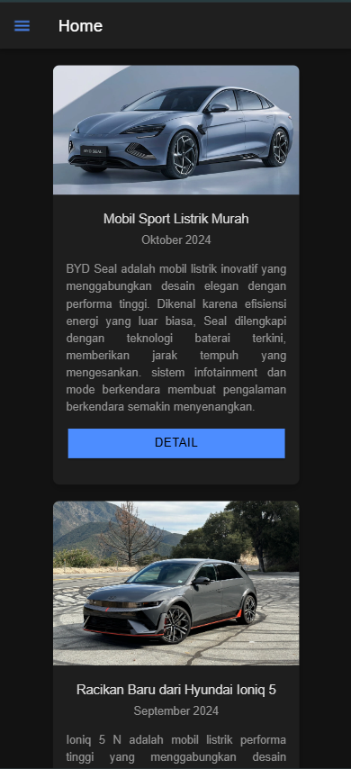
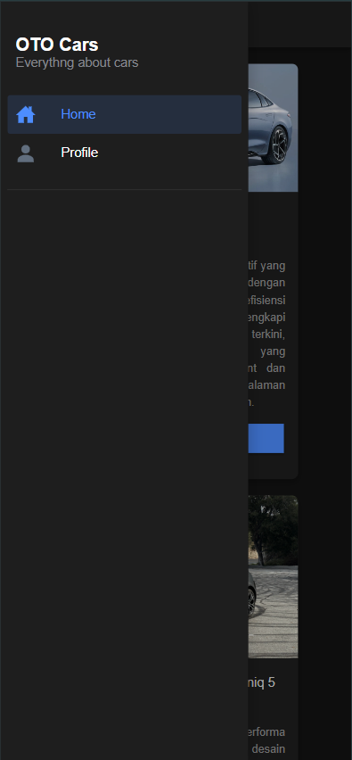

# Tugas Pertemuan 6
IONIC

Nama: Azzam Dicky Umar Widadi 
NIM: H1D022090  
Shift KRS: D
Shift Baru: F

## Screenshot




Pada tugas pertemuan 6 ini saya menggunakan komponen dari ionic component yaitu card

1. Card untuk halaman Home
```html
<ion-card>
      
      <ion-card-header>
        <ion-card-title class="small-title">Mobil Sport Listrik Murah</ion-card-title>
        <ion-card-subtitle>Oktober 2024</ion-card-subtitle>
      </ion-card-header>

      <ion-card-content class="justified-content">
        BYD Seal adalah mobil listrik inovatif yang menggabungkan desain elegan dengan performa tinggi. Dikenal karena efisiensi
        energi yang luar biasa, Seal dilengkapi dengan teknologi baterai terkini, memberikan jarak tempuh yang mengesankan.
        sistem infotainment dan mode berkendara membuat pengalaman berkendara semakin menyenangkan.
        <ion-button expand="full" color="primary" class="detail-button">Detail</ion-button>
      </ion-card-content>
    </ion-card>

    <ion-card>
      
      <ion-card-header>
        <ion-card-title class="small-title">Racikan Baru dari Hyundai Ioniq 5</ion-card-title>
        <ion-card-subtitle>September 2024</ion-card-subtitle>
      </ion-card-header>

      <ion-card-content class="justified-content">
        Ioniq 5 N adalah mobil listrik performa tinggi yang menggabungkan desain futuristik dengan teknologi mutakhir. Dikenal
        karena akselerasi cepat dan handling yang responsif, Ioniq 5 N menawarkan pengalaman berkendara yang luar biasa.

        <ion-button expand="full" color="primary" class="detail-button">Detail</ion-button>
      </ion-card-content>
    </ion-card>

    <ion-card>
      
      <ion-card-header>
        <ion-card-title class="small-title">Mobil Menjadi Gorengan para Car Enthusiast</ion-card-title>
        <ion-card-subtitle>Agustus 2024</ion-card-subtitle>
      </ion-card-header>

      <ion-card-content class="justified-content">
        Suzuki Jimny 2 Door adalah SUV compact yang terkenal dengan kemampuannya di medan off-road. Dengan desain ikonik dan
        fitur-fitur seperti sistem penggerak empat roda dan ground clearance yang tinggi, Jimny 2 Door menawarkan pengalaman
        berkendara yang menyenangkan baik.

        <ion-button expand="full" color="primary" class="detail-button">Detail</ion-button>
      </ion-card-content>
    </ion-card>
```

2. Bagian profile
```html
<div class="profile-container">
      <ion-avatar class="profile-avatar">
        
      </ion-avatar>
    
      <h2 class="profile-name">Azzam Dicky Umar Widadi</h2>
      <p class="profile-nim">H1D022090</p> <!-- Perbaikan di sini -->
    
      <div class="profile-info">
      
        <ion-item>
          <ion-label position="stacked">Telepon</ion-label>
          <ion-input type="tel" value="+6285456789054" disabled></ion-input>
        </ion-item>
      
        <ion-item>
          <ion-label position="stacked">Tanggal Lahir</ion-label>
          <ion-input type="date" value="2000-01-01" disabled></ion-input>
        </ion-item>
      
        <ion-item>
          <ion-label position="stacked">Alamat</ion-label>
          <ion-input type="text" value="Jl. Mawar, No. 18, Purwokerto Selatan" disabled></ion-input>
        </ion-item>
      </div>
</div>
```
